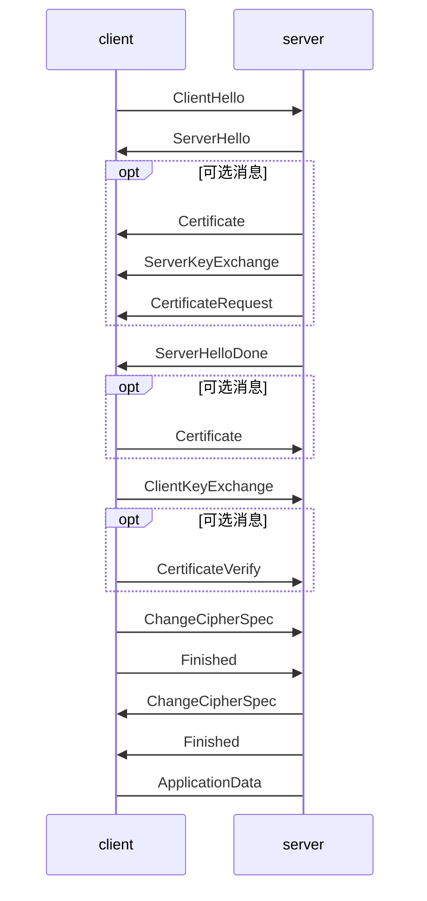

### 1 导语

​	随着网络安全问题得到各界前所未有的关注，HTTPS协议作为保障互联网安全的重要协议之一，其使用率也水涨船高，迎来了蓬勃发展的历史机遇。标志性事件有：

* Google, Facebook, Amazon,百度,阿里等互联网巨头先后进入了全站HTTPS的时期
* [全球有50%以上的网络流量使用HTTPS进行传输](https://www.google.com/transparencyreport/https/metrics/?hl=en)
* 英美强制要求所有政府网站2016年实现全站HTTPS加密
* 百度、Google等搜索引擎优先收录HTTPS页面并提升排名
* 新一代HTTP/2 协议的支持需以HTTPS 为基础

### 2 协议发展历程

​	TLS1.3协议在之前的协议基础上进行了大量的修改，甚至有人提议新的协议名称应该为TLS2.0。TLS1.3协议已经相继推出了21个草案版本，即将完成最终的标准化。标准化完成之后，OpenSSL组织将推出OpenSSL 1.1.1版本，该版本提供对TLS1.3协议标准的支持。

​	本文主要分享TLS1.3协议较之前版本的改进点：安全强化、效率提升、可扩展性增强，并且详细说明实现这些改进的方法。

### 3 安全强化

​	TLS1.3依循极简主义的设计哲学，移除和修复了协议中的坏味道，将可能存在的安全隐患剔除出该版本，防范于未然。这些坏味道分别存在于密钥交换、对称加解密、压缩等环节中。

#### 3.1 密钥交换

##### 3.1.1 PFC

​	TLS1.3协议中选取的密钥交换算法都支持前向安全性。斯诺登事件之后互联网企业开始重视数据的前向安全性，选用的加密算法也趋项于支持前向安全性，防止私钥被破解之后历史数据也能被解密成明文。

​	为了达到上述安全目的，TLS1.3协议中废除了不支持前向安全性的RSA和静态DH密钥交换算法，只支持(EC)DHE密钥交换算法。

##### 3.1.2 DSA

​	DSA证书作为历史遗留产物，从来没有被大规模用过，安全性差，故在TLS1.3协议被废弃。

##### 3.1.3 RSA填充

​	协议中规定RSA填充模式使用PSS。

##### 3.1.4 任意的DH组

​	协议中限制选择任意的DH组。

​	如果选用了不“安全”的素数作为DH的组参数，并且使用静态DH密码套件或使用默认OpenSSL配置的DHE加密套件（特别是SSL_OP_SINGLE_DH_USE选项未设置），就很容易受到[Key Recovery Attack](http://blog.intothesymmetry.com/2016/01/openssl-key-recovery-attack-on-dh-small.html)攻击。

#### 3.2 对称加密

##### 3.2.1 CBC

​	不再支持CBC模式加密算法。

​	针对CBC模式加密算法的攻击，历史上出现过两次，分别是[2011年出现的BEAST](https://en.wikipedia.org/wiki/Transport_Layer_Security#BEAST_attack)和[2013年出现的Lucky 13](https://en.wikipedia.org/wiki/Lucky_Thirteen_attack)，实践证明这种对称加密模式是存在安全隐患的。

##### 3.2.2 RC4

​	不再支持RC4流加密算法。

​	2011年9月研究人员发现了BEAST攻击，该攻击针对所有基于CBC模式的加密算法。为了解决这个问题，专家建议采用非CBC模式并且普及率较高的RC4算法作为替代方案，由此RC4算法得到广泛应用。

​	随着TLS版本的演进，BEAST攻击可以通过升级到新的版本来解决，而不必要采用RC4这种陈旧的算法来替代。另外，2013年，英国皇家哈洛威学院的研究人员发现了一种针对TLS的攻击，该攻击可以[从RC4算法加密的密文中恢复出少量明文](http://www.isg.rhul.ac.uk/tls/)，证明了这种算法无法提供让人放心的安全等级。

​	为了防止RC4算法被彻底破解，导致之前加密的网络流量被解密出现严重的安全事故，互联网公司逐渐废弃了这个算法。2014年，CloudFlare[将RC4算法的优先级从最高降为最低](https://blog.cloudflare.com/killing-rc4-the-long-goodbye/)。2015年，IETF组织在[rfc7465](https://tools.ietf.org/html/rfc7465)中明确指出要禁用RC4流加密算法。

##### 3.2.3 SHA1

​	不再支持SHA1。

​	早在2005年研究机构就发现SHA1存在理论上的漏洞，可能造成碰撞攻击。

​	2013年开始微软、Google、Symantec等相关厂商相继公布SHA1证书的[升级计划](https://www.chinassl.net/faq/n569.html)并宣布2017年开始停止信任SHA1证书。2017年初Google与荷兰研究机构CWI Amsterdam共同宣布破解SHA1，将SHA1的碰撞攻击从理论转变为现实。

##### 3.2.4 出口密码套件

​	不再支持出口密码套件。

​	[出口密码套件](https://crypto.stackexchange.com/questions/41769/what-does-export-grade-cryptography-mean-and-how-this-related-to-logjam-attac)是指1990年代美国政府为了让NSA能够破解所有加密的外国通讯消息，规定出口的加密套件必须是安全性较弱的密码套件。例如私钥长度不能大于512的RSA加密算法，这类加密套件被称为出口密码套件。在当时，安全等级较高的加密套件被是为战争武器禁止出口。

​	尽管2000年之后美国放宽了密码出口管制，但是由于历史遗留的问题，许多实际场景中仍然使用出口加密套件进行协商，导致出现了[FREAK](https://censys.io/blog/freak)和[LogJam](https://weakdh.org/)攻击，这两种攻击通过中间人将加密套件降级成出口套件，进而将数据破解。

#### 3.3 压缩

​	不再支持TLS压缩特性。

​	由于TLS压缩存在安全漏洞，TLS1.3协议删除了该特性。该漏洞表现为通过[CRIME攻击](https://zh.wikipedia.org/wiki/CRIME)可窃取启用数据压缩特性的HTTPS或SPDY协议传输的Cookie。在成功解读身份验证Cookie后，攻击者可以实行会话劫持和发动进一步攻击。

#### 3.4 加密握手消息

​	TLS1.3协议中规定在ServerHello消息之后的握手信息是需要加密的。TLS1.2及之前版本的协议中各种扩展信息是在ServerHello中以明文的方式进行发送的，在新版本中可以通过EncryptedExtension消息进行加密之后，在ServerHello消息之后发送，增加数据安全性。

### 4、效率提升

​	对于互联网服务而言更快的页面加载意味着更好的用户体验，从而也能带动产品销售的提升。

​	HTTPS在提高网络安全的同时也增加了额外的性能消耗，包括额外的SSL握手交互过程，数据加解密对CPU的消耗等。TLS1.3在提高效率方面也做了大量的改进工作，特别是对SSL握手过程进行了重新设计，将握手的交互延时从2-RTT降低为1-RTT甚至是0-RTT。在网络环境较差或者节点距离较远的情况下，这种优化能节省几百毫秒的时间。这几百毫秒就能决定人们下一步的行为是[继续浏览网页还是关闭网页](https://hpbn.co/primer-on-web-performance/#speed-performance-and-human-perception)。

​	在客户端发起HTTP请求之前，需要SSL握手过程完成密钥交换，协商出双方一致的对称密钥。后续所有的消息都用协商得到的密钥进行加密保护数据安全性。下面先介绍下TLS1.2协议完整的SSL握手过程，如下图所示。

* 首先客户端发送ClientHello消息，该消息中主要包括客户端支持的协议版本、加密套件列表及各种握手过程需要用到的扩展信息。
* 服务端根据客户端的消息选择合适的加密套件，发送对应的证书给客户端。如果是DH加密套件，则计算出用来计算对称密钥的共钥，通过ServerKeyExchange发送给客户端。

#### 4.1 1-RTT

​	

#### 4.2 0-RTT

​	为了使TLS协议的性能得到极致提升，TLS1.3协议提出了0-RTT的工作模式。

### 5、可扩展性

TLS1.3协议引入了大量扩展字段，提高了协议的可扩展性。

