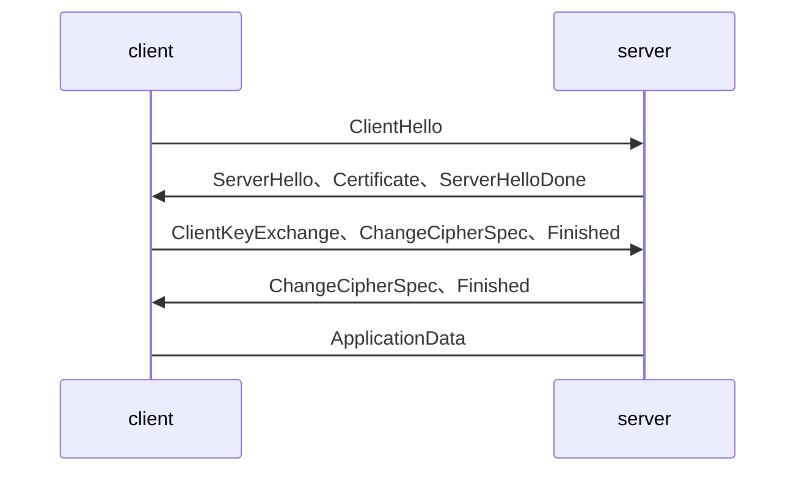
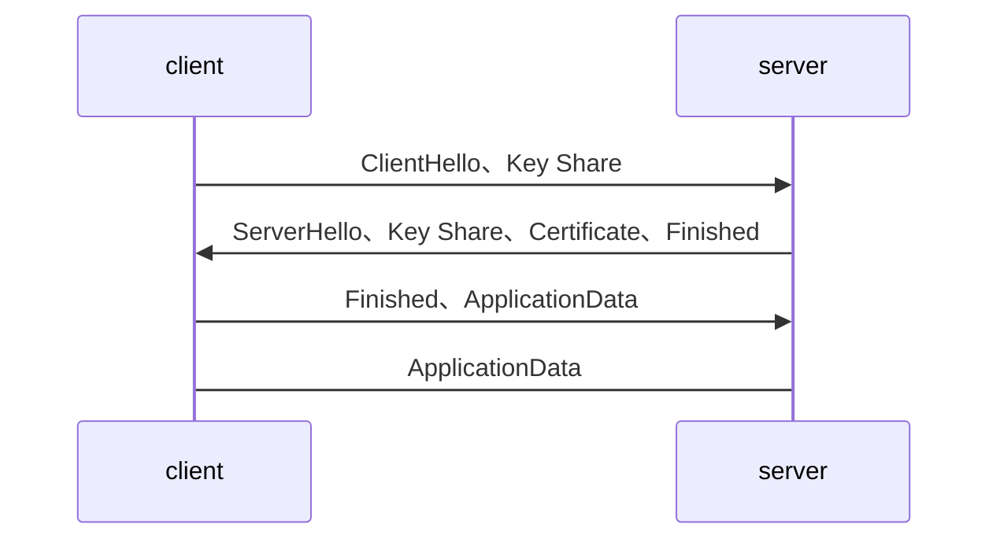

### 1 协议发展历程

​	SSL协议起源于1994年，当时网景公司推出首版网页浏览器以及HTTPS协议，使用的就是SSL进行加密。此后相继推出SSL2.0及3.0版本，在1999年的时候IETF将SSL标准化，即 [RFC 2246](https://tools.ietf.org/html/rfc2246) ，并将其称为TLS。2006年和2008年又分别推出TLS1.1和TLS1.2版本。在SSL/TLS发展过程中也出现过各种安全漏洞，比较著名的有Heartbleed、POODLE等，导致SSL3.0及其之前版本被逐渐废弃，目前互联网使用的主流协议是TLS1.2版本。

​	TLS1.3协议针对安全强化及效率提升等方面进行了大量的修改，相继推出了21个草案版本，即将完成最终的标准化。标准化完成之后，OpenSSL组织将推出OpenSSL 1.1.1版本提供对TLS1.3协议标准的支持。

### 2 安全强化

​	TLS1.3依循极简主义的设计哲学，移除和修复了旧版本协议中的坏味道，将可能存在的安全隐患剔除出该版本，防范于未然。这些隐患分别存在于密钥交换、对称加解密、压缩等环节中。

#### 2.1 密钥交换

##### 2.1.1 完全支持PFC

​	TLS1.3协议中选取的密钥交换算法都支持前向安全性。斯诺登事件之后互联网企业开始重视加密算法的前向安全性，防止私钥被破解之后历史数据也能被解密成明文。

​	为了达到上述安全目的，TLS1.3协议中废除了不支持前向安全性的RSA和静态DH密钥交换算法，只支持(EC)DHE密钥交换算法。

##### 2.1.2 废弃DSA证书

​	DSA证书作为历史遗留产物，从来没有被大规模用过，安全性差，故在TLS1.3协议被废弃。

##### 2.1.3 RSA填充模式更改

​	协议中规定RSA填充模式使用PSS。

##### 2.1.4 禁用自定义的DH组参数

​	如果选用了不“安全”的素数作为DH的组参数，并且使用静态DH密码套件或使用默认OpenSSL配置的DHE加密套件（特别是SSL_OP_SINGLE_DH_USE选项未设置），就很容易受到[Key Recovery Attack](http://blog.intothesymmetry.com/2016/01/openssl-key-recovery-attack-on-dh-small.html)攻击。

#### 2.2 对称加密

##### 2.2.1 禁用CBC模式

​	针对CBC模式加密算法的攻击，历史上出现过两次，分别是[2011年出现的BEAST](https://en.wikipedia.org/wiki/Transport_Layer_Security#BEAST_attack)和[2013年出现的Lucky 13](https://en.wikipedia.org/wiki/Lucky_Thirteen_attack)，实践证明这种对称加密模式是存在安全隐患的。

##### 2.2.2 禁用RC4流加密算法

​	2011年9月研究人员发现了BEAST攻击，该攻击针对所有基于CBC模式的加密算法。为了解决这个问题，专家建议采用非CBC模式并且普及率较高的RC4算法作为替代方案，由此RC4算法得到广泛应用。

​	随着TLS版本的演进，BEAST攻击可以通过升级到新的版本来解决，而不必要采用RC4这种陈旧的算法来替代。另外，2013年，英国皇家哈洛威学院的研究人员发现了一种针对TLS的攻击，该攻击可以[从RC4算法加密的密文中恢复出少量明文](http://www.isg.rhul.ac.uk/tls/)，证明了这种算法无法提供让人放心的安全等级。

​	为了防止RC4算法被彻底破解，导致之前加密的网络流量被解密出现严重的安全事故，互联网公司逐渐废弃了这个算法。2014年，CloudFlare[将RC4算法的优先级从最高降为最低](https://blog.cloudflare.com/killing-rc4-the-long-goodbye/)。2015年，IETF组织在[rfc7465](https://tools.ietf.org/html/rfc7465)中明确指出要禁用RC4流加密算法。

##### 2.2.3 禁用SHA1

​	早在2005年研究机构就发现SHA1存在理论上的漏洞，可能造成碰撞攻击。

​	2013年开始微软、Google、Symantec等相关厂商相继公布SHA1证书的[升级计划](https://www.chinassl.net/faq/n569.html)并宣布2017年开始停止信任SHA1证书。2017年初Google与荷兰研究机构CWI Amsterdam共同宣布破解SHA1，将SHA1的碰撞攻击从理论转变为现实。

##### 2.2.4 禁用出口密码套件

​	[出口密码套件](https://crypto.stackexchange.com/questions/41769/what-does-export-grade-cryptography-mean-and-how-this-related-to-logjam-attac)是指1990年代美国政府为了让NSA能够破解所有加密的外国通讯消息，规定出口的加密套件必须是安全性较弱的密码套件。例如私钥长度不能大于512的RSA加密算法，这类加密套件被称为出口密码套件。在当时，安全等级较高的加密套件被是为战争武器禁止出口。

​	尽管2000年之后美国放宽了密码出口管制，但是由于历史遗留的问题，许多实际场景中仍然使用出口加密套件进行协商，导致出现了[FREAK](https://censys.io/blog/freak)和[LogJam](https://weakdh.org/)攻击，这两种攻击通过中间人将加密套件降级成出口套件，进而将数据破解。

#### 2.3 禁用TLS压缩

​	由于TLS压缩存在安全漏洞，TLS1.3协议删除了该特性。该漏洞表现为通过[CRIME攻击](https://zh.wikipedia.org/wiki/CRIME)可窃取启用数据压缩特性的HTTPS或SPDY协议传输的Cookie。在成功解读身份验证Cookie后，攻击者可以实行会话劫持和发动进一步攻击。

#### 2.4 加密握手消息

​	TLS1.3协议中规定在ServerHello消息之后的握手信息是需要加密的。TLS1.2及之前版本的协议中各种扩展信息是在ServerHello中以明文的方式进行发送的，在新版本中可以进行加密之后封装到EncryptedExtension消息中，在ServerHello消息之后发送，增加数据安全性。

### 3、效率提升

​	对于互联网服务而言更快的页面加载意味着更好的用户体验，从而也能带动产品销售的提升。

​	HTTPS在提高网络安全的同时也增加了额外的性能消耗，包括额外的SSL握手交互过程，数据加解密对CPU的消耗等。TLS1.3在提高效率方面也做了大量的改进工作，特别是对SSL握手过程进行了重新设计，将握手的交互延时从2-RTT降低为1-RTT甚至是0-RTT。在网络环境较差或者节点距离较远的情况下，这种优化能节省几百毫秒的时间。这几百毫秒就能决定人们下一步的行为是[继续浏览网页还是关闭网页](https://hpbn.co/primer-on-web-performance/#speed-performance-and-human-perception)。

#### 3.1 2-RTT

​	下面以RSA密钥交换算法为例介绍下TLS1.2协议完整的SSL握手过程，如下图所示。

*   首先客户端发送ClientHello消息，该消息中主要包括客户端支持的协议版本、加密套件列表、随机数random1及握手过程需要用到的扩展信息。

* 服务端回复server_hello，包含选定的加密套件、一个随机数random2，以及证书。

* 客户端接收到random2之后就能够生成预主密钥以及主密钥，并使用证书公钥将预主密钥加密后发送给服务端。

* 服务端使用私钥解密得到预主密钥。又由于服务端之前就收到了random1，所以服务端根据相同的生成算法，在相同的输入参数下，求出了相同的主密钥。

* 使用主密钥对消息进行加密传输，保证消息的安全。

  从上述过程可以看出，在TLS1.2中需要进行加密套件协商、加密结束通告（ChangeCipherSpec）等过程，完整握手需要消耗2RTT的握手时间，这是造成HTTPS协议较慢的一个重要原因。

#### 3.2 1-RTT

​	TLS1.3协议只支持DHE的密钥交换算法，不需要进行加密套件的协商，将握手的消耗减少了一半，完整的握手只需要1RTT即可完成。

#### 3.3 0-RTT

​	为了使TLS协议的性能得到极致提升，TLS 1.3提出了0-RTT的工作模式。对于客户最近访问过的网站，可以在第一次交互的时候就发送加密的数据给服务器。

​	具体的实现过程是：客户端和服务端通过历史交互记录或者是外部输入的方式共享PSK，在这种情况下允许客户端在第一次交互的ClientHello消息中包含应用数据，该数据使用PSK进行加密。

​	0-RTT的模式不具有前向安全性，且消息可能被用作重放攻击，所以安全性较低，需要慎重使用。

