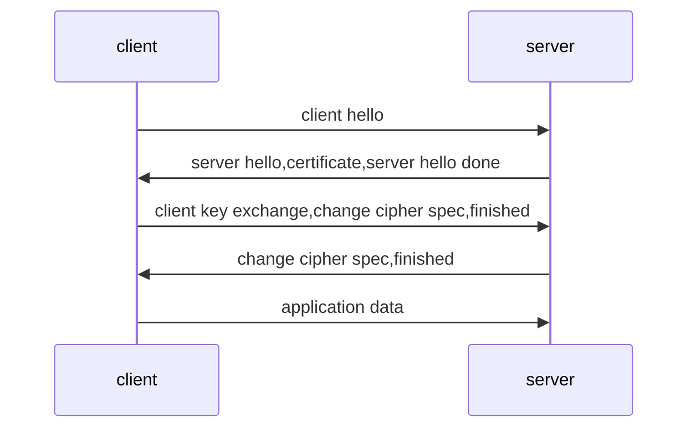

自从使用mac之后，开始发现markdown这种东西，确实简单方便。强推一款markdown应用typora，方便易用，所见即所得，且支持多种扩展：[diagrams](http://support.typora.io/Draw-Diagrams-With-Markdown/)、latex等等。

[mermaid语法介绍](https://knsv.github.io/mermaid/#initialization)

### 图表例子

