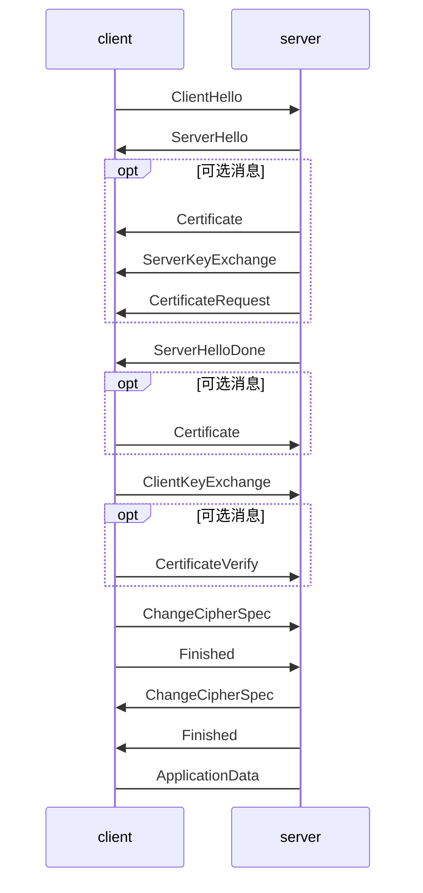
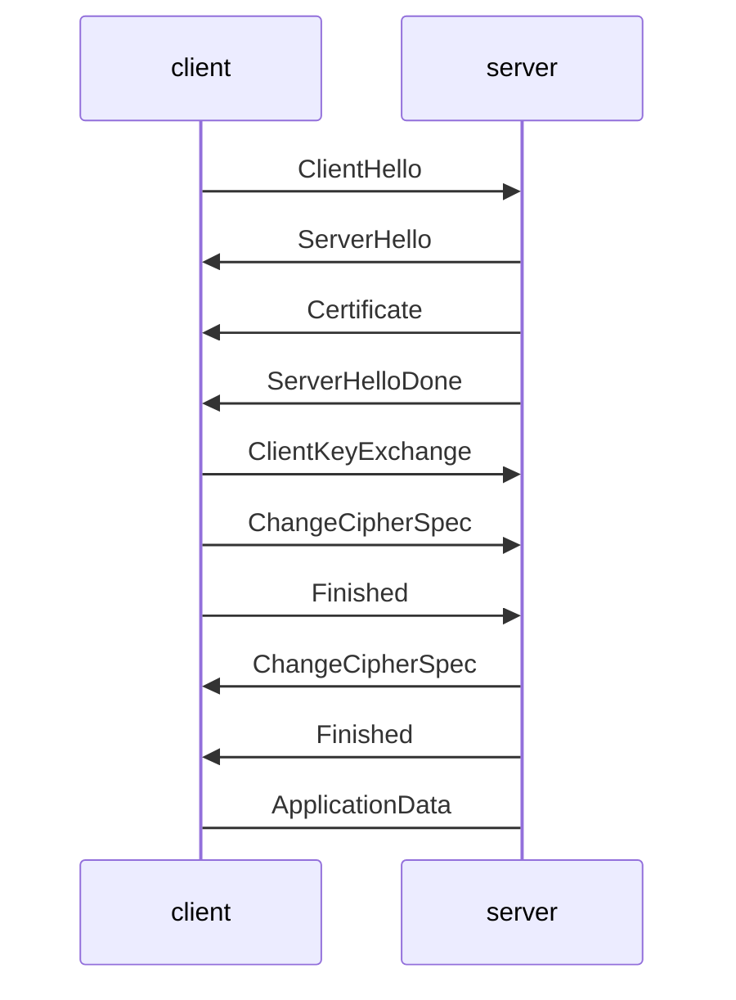

### 导语

​	在客户端发起HTTP请求之前，需要SSL握手过程完成密钥交换，协商出双方一致的对称密钥。后续所有的消息都用协商得到的密钥进行加密保护数据安全性。密钥交换算法分成rsa和dh算法，其中dh算法又可以根据选用的group生成ecdh算法，根据参数的临时性生成dhe算法。其中ecdhe算法由于具有前向安全性（pfs:perfect-forword secrecy)得到越来越广泛的应用，内部测试该算法的使用率高于90%。

### dh交换算法

DH算法有一个比较大的缺陷就是需要提供足够大的私钥来保证安全性，所以比较消耗CPU计算资源。ECC椭圆曲线算术能够很好的解决这个问题，224位的密钥长度就能达到RSA2048位的安全强度。

下面先介绍下TLS1.2协议完整的SSL握手dh类密钥交换过程，如下图所示。



* 浏览器发送client_hello，包含一个随机数random1，同时需要有2个扩展： 
  * Elliptic_curves：客户端支持的曲线类型和有限域参数。现在使用最多的是256位的素数域，参数定义如上节所述。 
  * Ec_point_formats：支持的曲线点格式，默认都是uncompressed。 
*  服务端回复server_hello，包含一个随机数random2及ECC扩展。 
* 服务端回复certificate，携带了证书公钥。 
* 服务端生成ECDH临时公钥，同时回复server_key_exchange，包含三部分重要内容： 
  - ECC相关的参数。 
  - ECDH临时公钥。 
  - ECC参数和公钥生成的签名值，用于客户端校验。  
* 浏览器接收server_key_exchange之后，使用证书公钥进行签名解密和校验，获取服务器端的ECDH临时公钥，生成会话所需要的共享密钥。至此，浏览器端完成了密钥协商。 
* 浏览器生成ECDH临时公钥和client_key_exchange消息，跟RSA密钥协商不同的是，这个消息不需要加密了。 
* 服务器处理client_key_exchang消息，获取客户端ECDH临时公钥。 
*  服务器生成会话所需要的共享密钥。
*  Server端密钥协商过程结束。

### rsa交换过程



* 浏览器发送client_hello，包含一个随机数random1。
* 服务端回复server_hello，包含一个随机数random2，同时回复certificate，携带了证书公钥P。
* 浏览器接收到random2之后就能够生成premaster_secrect以及master_secrect。其中premaster_secret长度为48个字节，前2个字节是协议版本号，剩下的46个字节填充一个随机数。结构如下：

```
Struct {
    byte Version[2];
    bute random[46];
}
```

master secrect的生成算法简述如下：

```
Master_key = PRF(premaster_secret, “master secrect”, 随机数1+随机数2)

其中PRF是一个随机函数，定义如下：

PRF(secret, label, seed) = P_MD5(S1, label + seed)  XOR  P_SHA-1(S2, label + seed)
```

从上式可以看出，把premaster_key赋值给secret，”master key”赋值给label，浏览器和服务器端的两个随机数做种子就能确定地求出一个48位长的随机数。 
而master secrect包含了六部分内容，分别是用于校验内容一致性的密钥，用于对称内容加解密的密钥，以及初始化向量（用于CBC模式），客户端和服务端各一份。 
至此，浏览器侧的密钥已经完成协商。

- 浏览器使用证书公钥P将premaster_secrect加密后发送给服务器。
- 服务端使用私钥解密得到premaster_secrect。又由于服务端之前就收到了随机数1，所以服务端根据相同的生成算法，在相同的输入参数下，求出了相同的master secrect。


