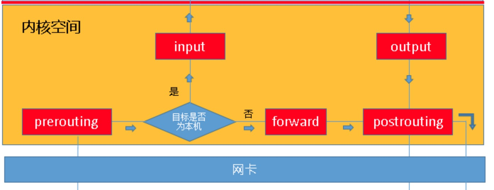
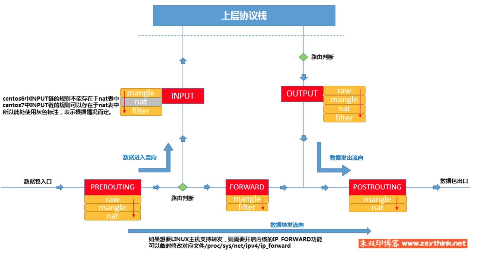

### iptables入门

#### 前言

本文参考详见[链接](http://www.zsythink.net/archives/1199)

前述链接中的内容已经涵盖了大量的信息，此处班门弄斧的目的是为了记录本人认为的关键点，加深对iptables的印象。

#### iptables是啥

iptables是在linux系统上内核防火墙架构netfilter在用户态的代理工具。通过这个工具可以将相应的安全规则设置到netfilter中。

#### 基础概念

##### 链

iptables在报文处理的逻辑中hook了5个处理阶段，包括prerouting、input、forword、output、postrouting，这些处理阶段称为链。具体每个阶段在报文中的顺序见下图。



* 到本机进程的报文：prerouting->input
* 有本机转发的报文：prerouting->forword->postrouting
* 本机进程发出的报文：output->postrouting


##### 规则

可以通过iptables将规则设置到对应的链上，报文经过对应的处理阶段的时候就会根据设置的规则进行处理。规则包括匹配条件以及执行动作。

* 匹配条件包括基本匹配条件（源地址、目标地址等）以及扩展匹配条件（源端口、目标端口等），其中扩展匹配条件需要依赖扩展模块。
* 处理动作主要包括如下几种
  * **ACCEPT**：允许报文通过
  * **DROP**：丢弃报文
  * **REJECT**：拒绝报文，响应拒绝信息
  * **SNAT**：源地址转换，解决内网用户使用同一个公网地址上网的问题。
  * **MASQUERADE**：SNAT的特殊形式，适用于动态ip
  * **DNAT**：目标地址转换
  * **REDIRECT**：端口映射
  * **LOG**：记录信息后继续下一个规则的处理。信息记录在文件/var/log/messages中。

##### 表

规则是有规矩可循，所以在规则的基础上做了一层抽象，整理出4类对应的表。每个表表示一个类型的规则合集。具体如下

* filter表：负责过滤功能
* nat表：网络地址转换功能
* mangle表：报文修改
* raw表：关闭nat表上启用的连接追踪机制（？不太理解这个表述）

表的优先级是有顺序的，也就是不同的表挂载到链上之后是按照表的顺序执行的。raw->mangle->nat->filter

##### 表链关系

每个链支持的表是有规定的。详见下表

| 链\表           |   raw   | mangle  |       nat        | filter  |
| --------------- | :-----: | :-----: | :--------------: | :-----: |
| **prerouting**  | &radic; | &radic; |     &radic;      | &times; |
| **input**       | &times; | &radic; | &radic;(centos7) | &radic; |
| **forword**     | &times; | &radic; |     &times;      | &radic; |
| **output**      | &radic; | &radic; |     &radic;      | &radic; |
| **postrouting** | &times; | &radic; |     &radic;      | &times; |

##### 引用图例



#### 示例

[link][https://www.linuxprobe.com/25-iptables-common-examples.html]


```bash
阻止指定IP地址
BLOCK_THIS_IP="x.x.x.x"
iptables -A INPUT -s "$BLOCK_THIS_IP" -j DROP

允许所有SSH的连接请求
iptables -A INPUT -i eth0 -p tcp --dport 22 -m state --state NEW,ESTABLISHED -j ACCEPT

仅允许来自指定网络的SSH连接请求
iptables -A INPUT -i eth0 -p tcp -s 192.168.100.0/24 --dport 22 -m state --state NEW,ESTABLISHED -j ACCEPT

允许从本地发起的SSH请求
iptables -A OUTPUT -o eth0 -p tcp --dport 22 -m state --state NEW,ESTABLISHED -j ACCEPT
```


