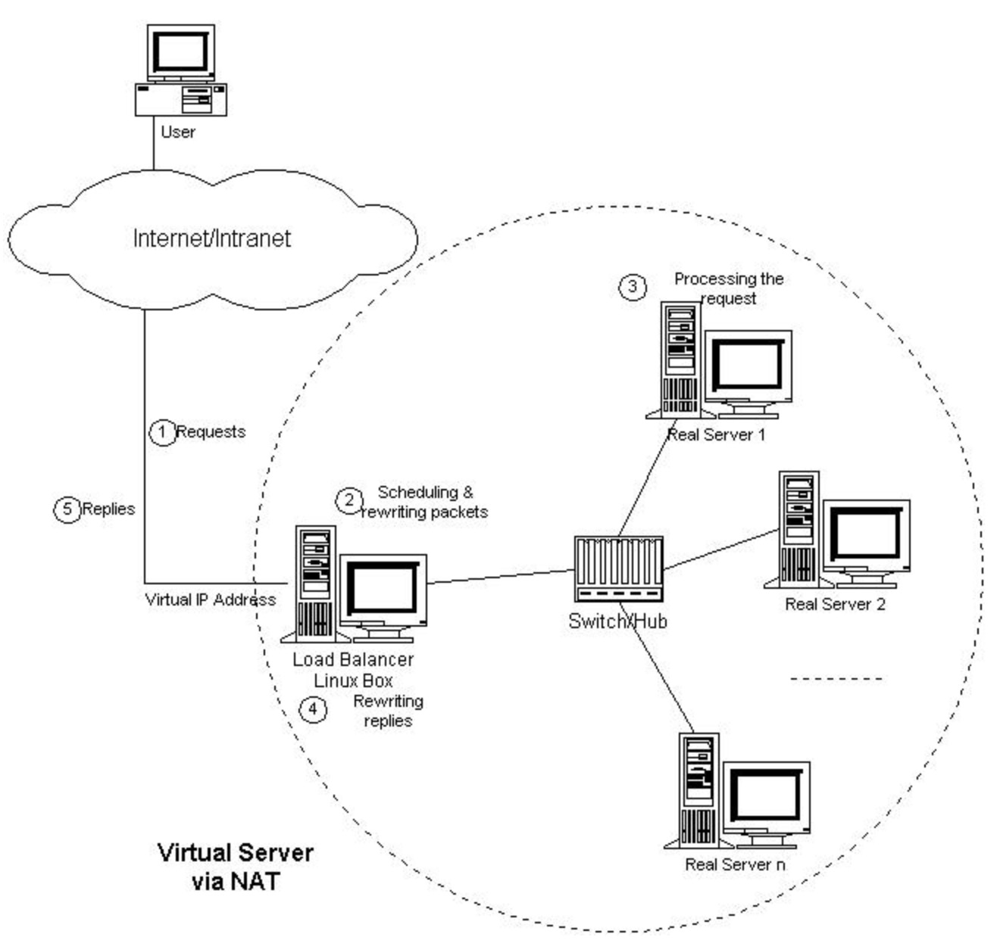
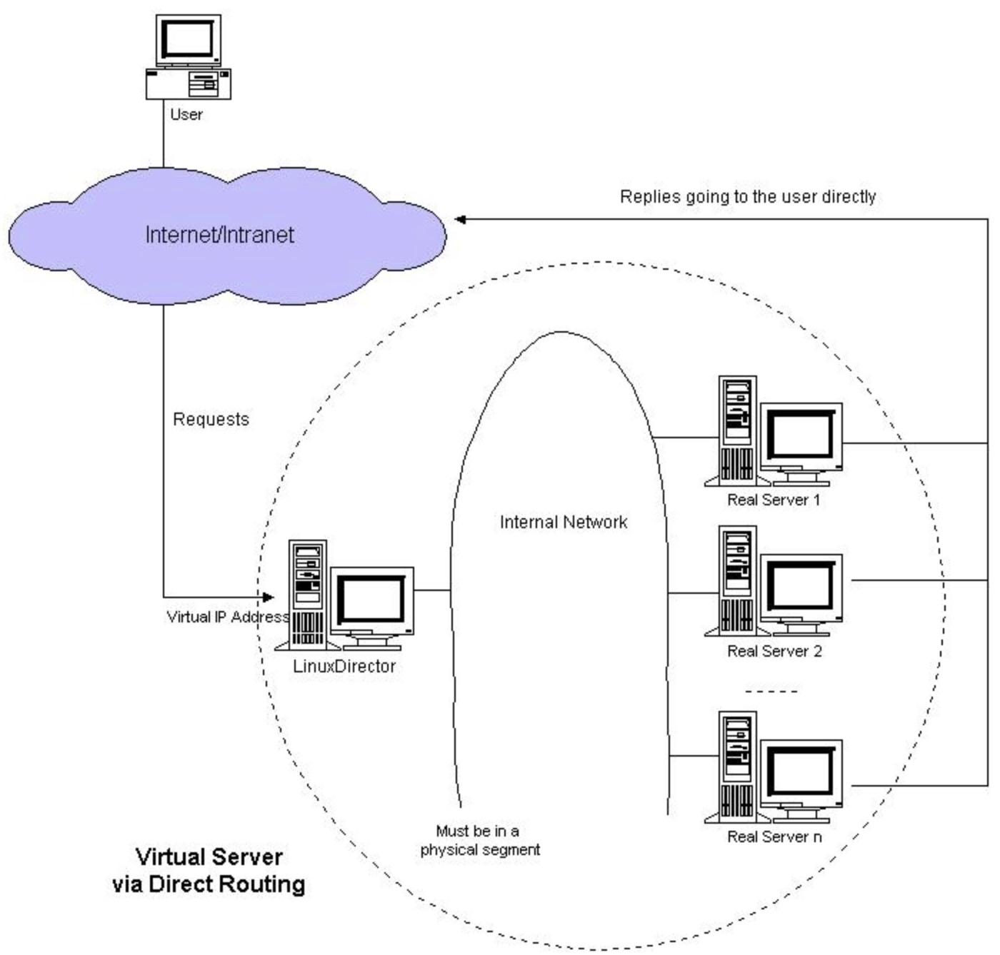

### lvs入门

#### 前言

为了解决机器过热的问题，业界引入了负载均衡技术，顾名思义就是按照一定规则把流量分发的不同的机器上。常见的负载均衡技术按照分类有如下两种：

* 按照实现方式分类：软件负载均衡、硬件负载均衡（f5）
* 按照作用的网络层次分类：4层（lvs）、7层（nginx）、4+7层（haproxy）

本文简单介绍下4层软件负载均衡技术lvs。

#### lvs工作模式

lvs是基于linux内核实现的功能，具体介绍详见[链接](http://www.linuxvirtualserver.org/zh/lvs1.html)，感谢章文嵩博士为我们提供了这么优秀的解决方案。

目前很多公司都给予lvs做4层负载均衡，包括阿里。lvs主要的工作模式有4个：**NAT** **DR** **TUNEL** **FULL-NAT**。本文重要介绍两种nat && dr。

#### NAT

NAT的全称是网络地址转换。lvs集群通过vip与客户端通信，rs与load balancer之间通过局域网ip通信。流量的出入都经过load balancer，load balancer负责nat功能，对ip进行转换。

由于所有的流量in && out都经过load balancer，所以load balancer会成为处理的瓶颈。

#### DR

dr（direct routing）模式利用互联网服务的非对称性特点（上行能力小于下行能力）。vip添加到rs的lo端口上，同时为了防止arp冲突，需要在rs的lo端口上关闭arp响应功能。请求到达linuxdirector之后通过修改mac将报文转发到指定的rs。rs处理完成之后直接从独立的网络路由发送响应给客户端，不需要经过linuxdirector，提高lvs集群系统的伸缩性。

